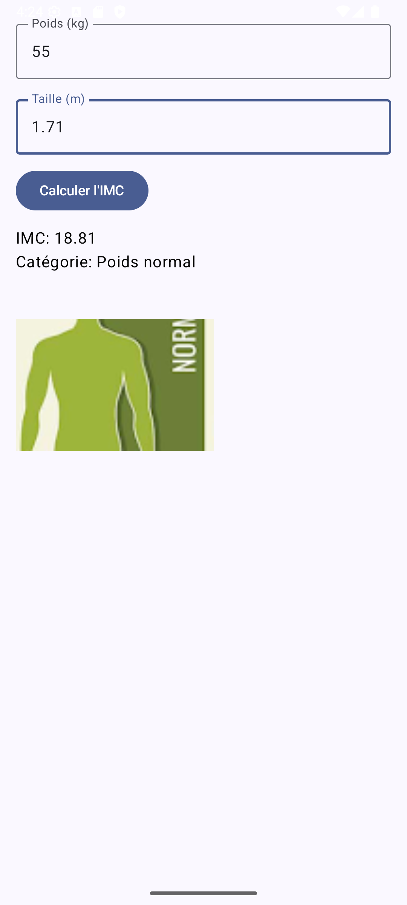

# Application mobile Android – Calcul de l'IMC (Indice de Masse Corporelle)

##  Description

Cette application mobile Android permet à l'utilisateur de :

- Saisir son **poids** (en kg) et sa **taille** (en m)
- Calculer automatiquement son **IMC**
- Afficher l'**image correspondante** à la catégorie de masse corporelle :

| Catégorie       | IMC             |
|-----------------|-----------------|
| Maigreur        | IMC < 18.5      |
| Normal          | 18.5 ≤ IMC < 25 |
| Surpoids        | 25 ≤ IMC < 30   |
| Obésité modérée | 30 ≤ IMC < 40   |
| Obésité sévère  | IMC ≥ 40        |

##  Formule utilisée

- IMC = poids (kg) / (taille (m))²

##  Fonctionnalités

- Interface simple et intuitive
- Calcul instantané de l'IMC
- Affichage dynamique de l'image liée à la catégorie IMC

##  Images de test affichées dans l'application

### Maigreur

### Corpulence normale

### Surpoids

### Obésité modérée

### Obésité sévère

